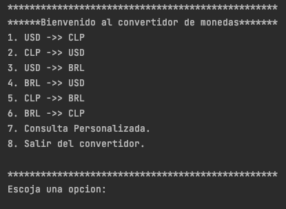
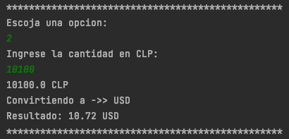
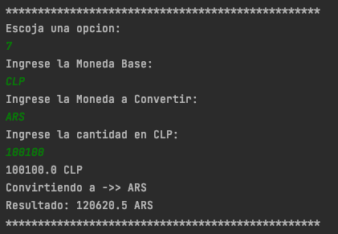
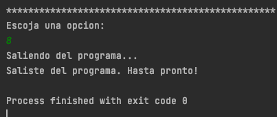

# 📌 Conversor de Monedas

DESCRIPCIÓN : Aplicación sencilla que permite convertir montos entre distintas monedas en tiempo real.
Utiliza una API externa para obtener las tasas de cambio actualizadas y ofrece una interfaz amigable para 
seleccionar monedas y ver el resultado instantáneamente.


---

## 🧰 Tecnologías / Herramientas

- Lenguaje: Java.
- Librerías: Gson.
- API: ExchangeRate-API - Free & Pro Currency Converter API  (https://www.exchangerate-api.com/)

## 🚀 Instalación

1. Clona el repositorio:
   ```bash
   git clone https://github.com/ju-avaria/conversor-monedas-aluradesafio.git
   ```
2. Descarga la librería Gson: https://mvnrepository.com/artifact/com.google.code.gson/gson
3. Agrega el archivo .jar a tu proyecto local.
4. Crea una API Key en ExchangeRate-API para hacer las consultas
5. Para conocer todas las monedas que el conversor acepta, puedes ingresar al siguiente link: 
   https://www.exchangerate-api.com/docs/supported-currencies

Conversor listo para usarse. 

## 💻 Uso de la aplicación:

1. Abre el proyecto y ejecuta el archivo: Principal.java

Al ejecutar este script se mostrará en la consola el siguiente menú:



Para realizar la conversión de alguna moneda, solo debes escojer una 
opcion (1-8) 

2. Las opciones de la 1 a la 6 proceden de la siguiente forma:



El programa solicitará ingresar una opcion.

Luego, preguntará por la cantidad a convertir.

El programa hará el cálculo y mostrará los resultados
en la consola.

3. Si la opcion elejida es la número 7. el programa funcionará de la siguente forma:



El programa solicitará ingresar una moneda base, luego una moneda a convertir
y por ultimo la cantidad de dinero en la moneda base.

Depues de ingresar todos los datos el programa realizará la conversión 
y mostrará el resultado en consola.

4. Si la opcion elejida es la número 8, se saldrá del programa y se moostrará lo siguente en consola:




## 📂 Estructura del Proyecto
```bash
conversor-monedas-aluradesafio/
├── .idea/
├── src/
│   └── ConsultaAPI.java
│   └── Menu.java
│   └── Moneda.java
│   └── MonedaAPI.java
│   └── Principal.java
├── out
├── images/
│   └── Menu.png
│   └── Opcion2.png
│   └── Opcion7.png
│   └── Opcion8.png  
└── README.md
```

---
Autor: https://github.com/ju-avaria


